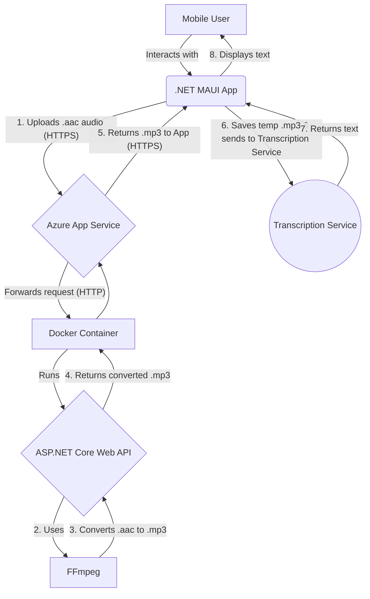

# gMat - General Mobile Audio Transcriber

gMat is a cross-platform mobile application built with .NET MAUI that allows users to record or select audio files and receive a text transcription. The application is architected with a modern client-server model, ensuring that heavy audio processing is handled by a powerful backend, providing a lightweight and responsive experience on the mobile device.

---

## Key Features

*   **Cross-Platform:** Runs on both Android and iOS from a single C# codebase.
*   **Audio Input:** Users can either record new audio directly in the app or pick existing audio files from their device.
*   **Server-Side Processing:** Audio files are securely uploaded to a backend API for conversion, keeping the mobile app fast and lightweight.
*   **Robust Audio Conversion:** Utilizes the powerful **FFmpeg** library on the backend to convert aac files from Signal to mp3 files for Groq's Whisper API.
*   **Text Transcription:** Displays the transcribed text returned from the audio processing pipeline.

## System Architecture

gMat uses a decoupled architecture to separate the mobile client from the backend processing service. This makes the system scalable, maintainable, and secure.



---

## Technology Stack

### Mobile App (Front-end)

*   **.NET 8**
*   **.NET MAUI:** For the cross-platform UI and application logic.
*   **C#:** Primary programming language.

### Backend API

*   **ASP.NET Core Web API:** For building the RESTful service.
*   **Docker:** For containerizing the backend application and its dependencies.
*   **FFmpeg:** The core audio processing library, installed within the Docker container.
*   **Azure App Service (for Containers):** Hosts the Docker container, providing a scalable, managed environment.
*   **Azure Container Registry (ACR):** Stores the production Docker image for secure and fast deployment.

---

## Project Structure

```
gMat-Solution/
├── gMat.Api/           # The ASP.NET Core Web API Backend
│   ├── Controllers/
│   │   └── ConversionController.cs
│   ├── Dockerfile
│   └── gMat.Api.csproj
│
└── gMat.Maui/          # The .NET MAUI Mobile App
    ├── Platforms/
    ├── Resources/
    └── gMat.Maui.csproj
```

---

## Getting Started: Local Development

### Prerequisites

*   **.NET 8 SDK**
*   **Visual Studio 2022** with the **.NET MAUI** workload installed.
*   **Docker Desktop** running on your machine.
*   An Android Emulator or physical device.

### 1. Running the Backend API (Locally in Docker)

1.  Open a terminal or PowerShell.
2.  Navigate to the API project's root directory:
    ```bash
    cd path/to/gMat-Solution/gMat.Api/
    ```
3.  Build the Docker image:
    ```bash
    docker build -t gmat-api .
    ```
4.  Run the container, mapping your local port `8080` to the container's internal port `80`:
    ```bash
    docker run -p 8080:80 gmat-api
    ```

### 2. Running the Mobile App

1.  Open the `gMat-Solution.sln` file in Visual Studio.
2.  In the MAUI project, find the code responsible for setting the API base URL.
3.  For local development against the Android Emulator, set the URL to `http://10.0.2.2:8080`. The IP `10.0.2.2` is a special alias for your PC's localhost.
4.  Set the `gMat.Maui` project as the startup project.
5.  Select your target Android Emulator and press **F5** to build and run the app.

---

## Deployment to Azure

The backend API is designed to be deployed as a container to Azure App Service.

1.  **Push Image to ACR:** The final Docker image is pushed to an Azure Container Registry instance.
2.  **Create App Service:** An Azure App Service is created with the "Docker Container" publish option.
3.  **Configure App Service:**
    *   The App Service is configured to pull its image from the ACR.
    *   The App Service by default will expose port **`80`** to match the port exposed in the `Dockerfile`.
4.  **CI/CD:** A GitHub Actions workflow can be set up to automatically build and push the Docker image to ACR and restart the App Service whenever code is pushed to the `main` branch.

## Future Improvements

*   **Support for More Formats:** Extend the FFmpeg conversion logic to handle a wider variety of input audio/video formats.
*   **Real-time Transcription:** Implement real-time audio streaming using WebSockets (SignalR) for live transcription.
*   **User Authentication:** Secure the API and allow users to save their transcription history.
*   **In-app Billing:** Add features for premium transcription services.

---

## License

This project is licensed under the **MIT License**.